# 2023-cmp

 

### 『𝐂𝐥𝐨𝐮𝐝 𝐌𝐚𝐧𝐚𝐠𝐞𝐦𝐞𝐧𝐭 𝐏𝐥𝐚𝐭𝐟𝐨𝐫𝐦, 𝐂𝐌𝐏』 : 숙원 사업 실현을 위한 전략적 접근

 

### 프로젝트 소개

  

### 팀원 소개

  

### 메뉴 구조도

  

### 화면 설계

<table>
<tr>
<td>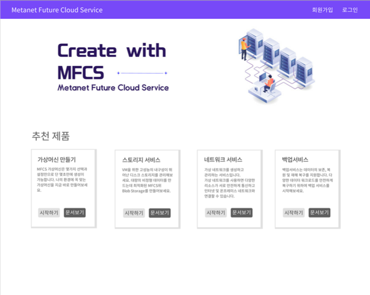</td>
<td>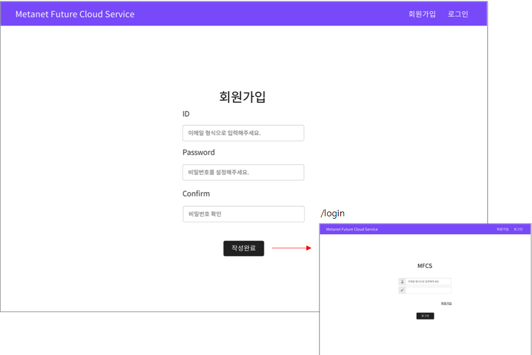</td>
<td>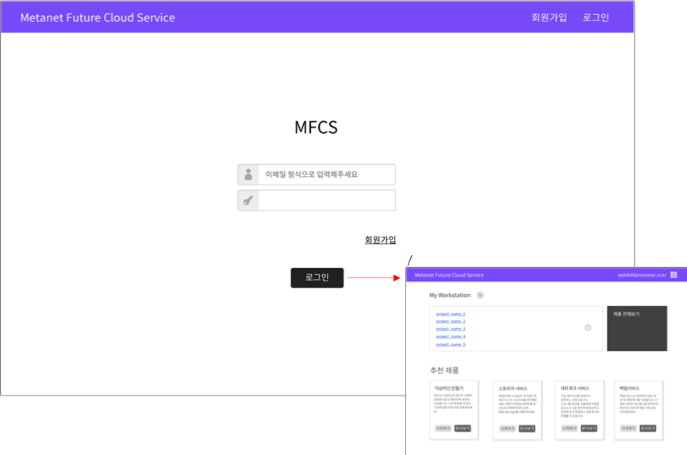</td>
</tr>
<tr>
<td>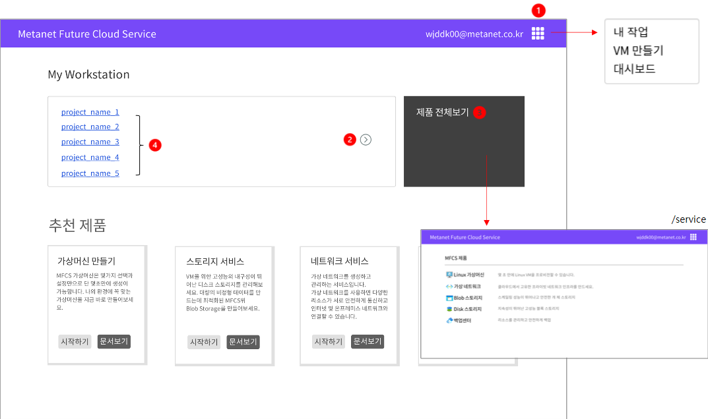</td>
<td>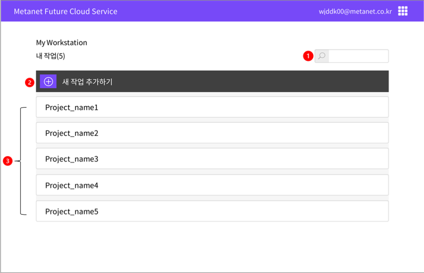</td>
<td>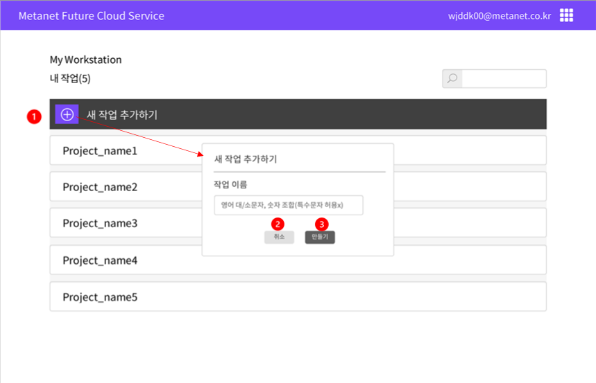</td>
</tr>
<tr>
<td>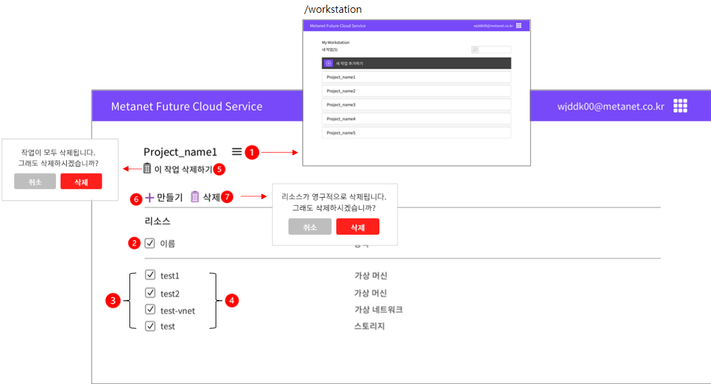</td>
<td>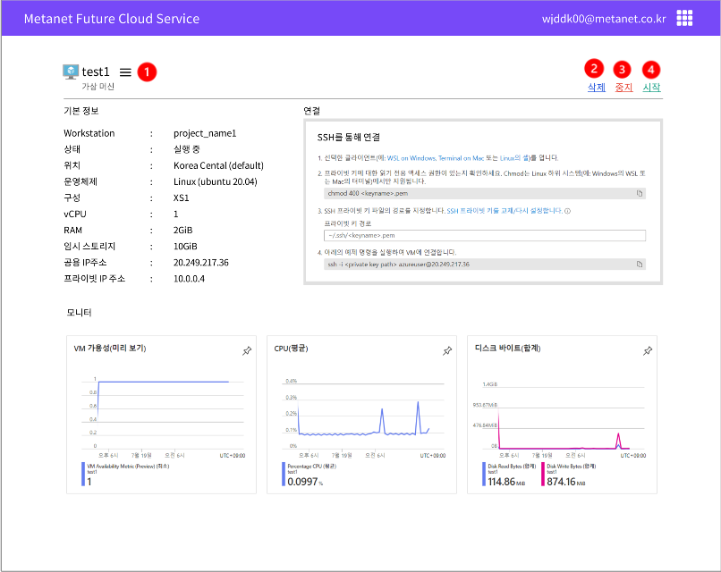</td>
<td>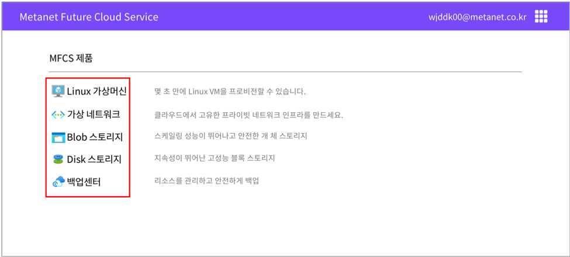</td>
</tr>
<tr>
<td>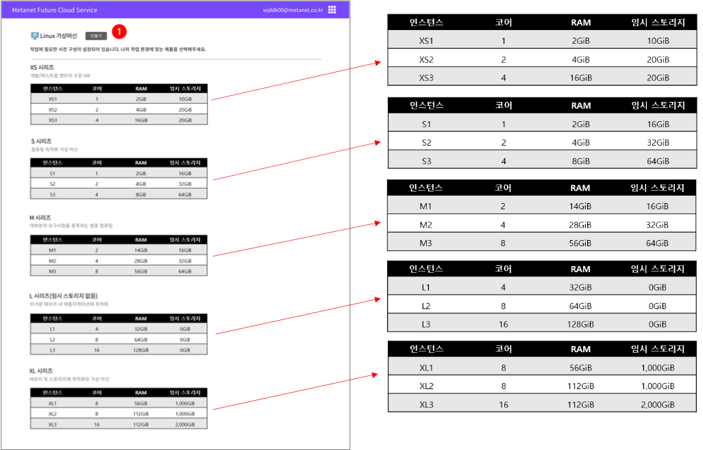</td>
<td>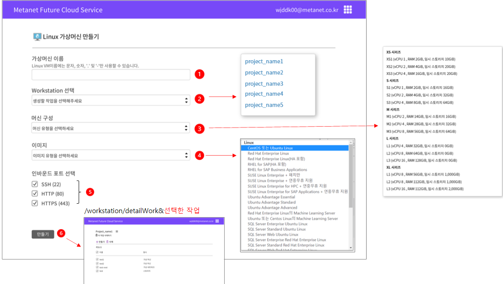</td>
</tr>
</table>

  

### 기술 스택

  

### 서버 구조도

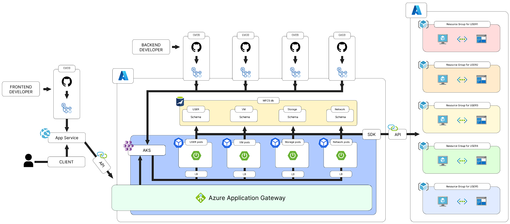

  

### DB - ERD

  

### 커밋 컨벤션

---

✅ 기본적으로 커밋 메시지는 제목 / 본문 / 관련 이슈로 구분  
✅ feat : 새로운 기능 추가  
✅ fix : 버그 수정  
✅ docs : 문서 수정  
✅ style : 코드 포맷팅, 세미콜론 누락, 코드 변경이 없는 경우  
✅ refactor : 코드 리펙토링  
✅ test : 테스트 코드, 리펙토링 테스트 코드 추가  
✅ chore : 기타 변경사항  
✅ 제목은 50자를 넘기지 않고, 맞침표를 붙이지 않는다.  

  

### 산출물

